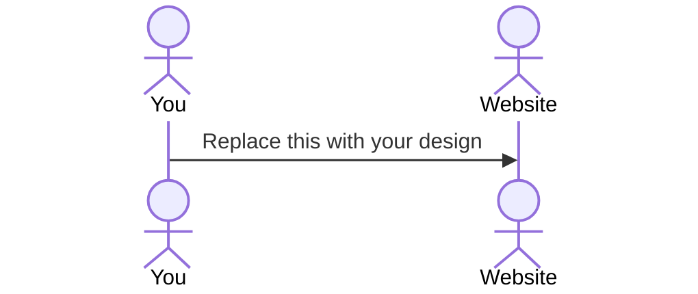

# Your startup name here

[My Notes](notes.md)
> [!NOTE]
> This is a template for your startup application. You must modify this `README.md` file for each phase of your development. You only need to fill in the section for each deliverable when that deliverable is submitted in Canvas. Without completing the section for a deliverable, the TA will not know what to look for when grading your submission. Feel free to add additional information to each deliverable description, but make sure you at least have the list of rubric items and a description of what you did for each item. TEST

> [!NOTE]
> If you are not familiar with Markdown then you should review the [documentation](https://docs.github.com/en/get-started/writing-on-github/getting-started-with-writing-and-formatting-on-github/basic-writing-and-formatting-syntax) before continuing.

## 🚀 Specification Deliverable

> [!NOTE]
> Fill in this sections as the submission artifact for this deliverable. You can refer to this [example](https://github.com/webprogramming260/startup-example/blob/main/README.md) for inspiration.

For this deliverable I did the following. I checked the box `[x]` and added a description for things I completed.

- [x] Proper use of Markdown
- [x] A concise and compelling elevator pitch
- [x] Description of key features
- [x] Description of how you will use each technology
- [x] One or more rough sketches of your application. Images must be embedded in this file using Markdown image references.

### Elevator pitch

I'm going to make a website for a local pest control business that my dad is in charge of. I want to create a website that will allow customers to create/log in to their accounts, see their upcoming appointments, and view what services are offered. Under the services offered, users can see a descriptive subpage of their current services and how much they cost. Users will have access to a dashboard where they can see their appointment history, and customize their address/ phone number, etc. (can be simplified to meet the class requirements)
### Design

Top Banner with phone number. The homepage will have a header with a logo and navigation (Services | About Us | Contact | Sign in)
Followed by Deals/ Promotions.
Summary of Services
Some Statistics/ Reviews
Schedule an Appointment
(can be simplified if needed)

### Key features

- Customer Accounts: Users can log in and have their individual accounts
- Appointments: Customers can schedule appointments and see current appointments 
- Service Information/ Current Weather: Customers can see available services with updated weather.

### Technologies

I am going to use the required technologies in the following ways.

- **HTML** - Homepage: Banner, Navigation, deals, services, stats, appointment section
- **CSS** - Style based on company colors (Black and Orange), and use animations for the buttons.
- **React** - Store information while the user is on the site, show the right page when the user clicks on a category
- **Service** - Shows available services/ current appointments. Allows users to log in/register and create appointments. Use the weather API.
- **DB/Login** - Stores user info ( email, password, history)
- **WebSocket** - The User dashboard after they log in updates when a new schedule is made/ canceled/or completed.

## 🚀 AWS deliverable

For this deliverable I did the following. I checked the box `[x]` and added a description for things I completed.

- [x] **Server deployed and accessible with custom domain name** - [My server link](https://phoenixpests.com).

## 🚀 HTML deliverable

For this deliverable I did the following. I checked the box `[x]` and added a description for things I completed.

- [x] I completed the prerequisites for this deliverable (Simon deployed, GitHub link, Git commits)
- [x] **HTML pages** - Six HTML pages that allow the user navigate through the website.
- [x] **Proper HTML element usage** - I used BODY,NAV,MAIN,HEADER,FOOTER,DIV,SPAN,FOLDER. 
- [x] **Links** - Created links to navigate through the website(the different navigation links such as ,Services,About Us, Contact Us, Sign in)
- [x] **Text** - Used text of different size to emphasize the most important elements.
- [x] **3rd party API placeholder** - Made a placeholder for my weather API, that will show the current weather.
- [x] **Images** - I included placeholder images because I wasn't sure exactly what i want to put there.
- [x] **Login placeholder** - Made a Log In button that users can use.
- [x] **DB data placeholder** - After logging in, the user can see their service history/ personal information.
- [x] **WebSocket placeholder** - The user can see live updates of the services they bought, and when they are completed.

## 🚀 CSS deliverable

For this deliverable I did the following. I checked the box `[x]` and added a description for things I completed.

- [x] **Visually appealing colors and layout. No overflowing elements.** - Used a dark theme, and spaced out all my elements. Nothing was overflowing, everything had a place.
- [x] **Use of a CSS framework** - I used Bootstrap for buttons!
- [x] **All visual elements styled using CSS** - I removed styling from my html and used a CSS file for my customization.
- [x] **Responsive to window resizing using flexbox and/or grid display** - I used Flexbox for my navigation bar, so everything is displayed properly when the window size changes.
- [x] **Use of a imported font** - Used an imported font from Google Fonts and used it on my whole page.
- [x] **Use of different types of selectors including element, class, ID, and pseudo selectors** - My different selectors were, element selectors (body,headings), class selectors (.site-navbar, .main-image), ID selector(#home-link) and pseudo selector(a:hover)

## 🚀 React part 1: Routing deliverable

For this deliverable I did the following. I checked the box `[x]` and added a description for things I completed.

- [ ] **Bundled using Vite** - I did not complete this part of the deliverable.
- [ ] **Components** - I did not complete this part of the deliverable.
- [ ] **Router** - I did not complete this part of the deliverable.

## 🚀 React part 2: Reactivity deliverable

For this deliverable I did the following. I checked the box `[x]` and added a description for things I completed.

- [ ] **All functionality implemented or mocked out** - I did not complete this part of the deliverable.
- [ ] **Hooks** - I did not complete this part of the deliverable.

## 🚀 Service deliverable

For this deliverable I did the following. I checked the box `[x]` and added a description for things I completed.

- [ ] **Node.js/Express HTTP service** - I did not complete this part of the deliverable.
- [ ] **Static middleware for frontend** - I did not complete this part of the deliverable.
- [ ] **Calls to third party endpoints** - I did not complete this part of the deliverable.
- [ ] **Backend service endpoints** - I did not complete this part of the deliverable.
- [ ] **Frontend calls service endpoints** - I did not complete this part of the deliverable.
- [ ] **Supports registration, login, logout, and restricted endpoint** - I did not complete this part of the deliverable.

## 🚀 DB deliverable

For this deliverable I did the following. I checked the box `[x]` and added a description for things I completed.

- [ ] **Stores data in MongoDB** - I did not complete this part of the deliverable.
- [ ] **Stores credentials in MongoDB** - I did not complete this part of the deliverable.

## 🚀 WebSocket deliverable

For this deliverable I did the following. I checked the box `[x]` and added a description for things I completed.

- [ ] **Backend listens for WebSocket connection** - I did not complete this part of the deliverable.
- [ ] **Frontend makes WebSocket connection** - I did not complete this part of the deliverable.
- [ ] **Data sent over WebSocket connection** - I did not complete this part of the deliverable.
- [ ] **WebSocket data displayed** - I did not complete this part of the deliverable.
- [ ] **Application is fully functional** - I did not complete this part of the deliverable.
